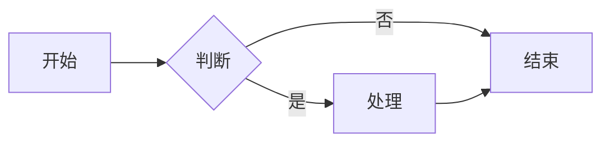
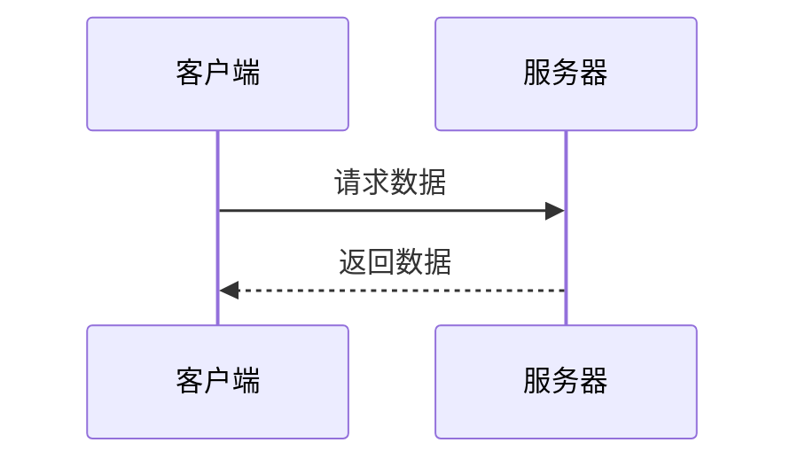
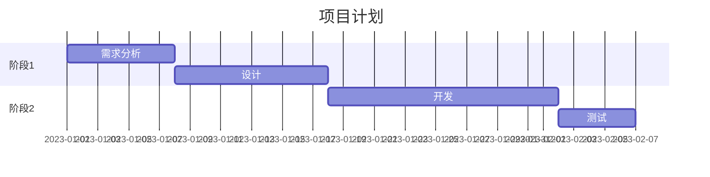

# NovaScript

一个现代化的实时一对一聊天应用，支持 Markdown 格式和丰富的消息功能。

## 功能特点

- 实时聊天功能
- Markdown 格式支持
- 代码高亮显示
- LaTeX 数学公式支持
- Mermaid 图表支持
- 表情符号支持
- 用户认证和授权
- 在线状态显示
- 响应式设计
- 图片 Lightbox 预览
  - 支持图片放大查看
  - 支持图片幻灯片播放
  - 支持键盘快捷键操作
  - 支持触摸屏手势操作
- 文件上传和分享
- 移动端友好的自适应界面

## 技术栈

- **后端**
  - Node.js + Express.js
  - Socket.IO 实时通信
  - SQLite 数据库
  - bcryptjs

- **前端**
  - HTML5 + CSS3
  - JavaScript
  - Socket.IO Client
  - Marked.js (Markdown 解析)
  - Highlight.js (代码高亮)
  - KaTeX (数学公式)
  - Mermaid (图表)
  - Emoji Toolkit

## 部署指南

### 前提条件

- Git
- Node.js 20.x (如需本地开发)
- Docker 和 Docker Compose (如使用容器部署)

### 方式一：直接部署

1. 克隆仓库：
```bash
git clone https://github.com/davoola/NovaScript.git
cd NovaScript
```

2. 安装依赖：
```bash
npm install
```

3. 初始化必要的目录和配置：
```bash
# 创建必要的目录
mkdir -p data/db public/uploads

# 从示例文件创建用户配置
cp data/users.json.example data/users.json
```

4. 创建环境变量文件（可选）：
```bash
cp .env.example .env
```
然后编辑 `.env` 文件配置你的环境变量。

5. 启动服务器：
```bash
npm start
```

默认情况下，应用将在 http://localhost:3000 运行。

### 方式二：Docker 部署

#### A. 使用 Docker Compose 部署（推荐）

```bash
# 克隆仓库
git clone https://github.com/davoola/NovaScript.git
cd NovaScript

# 创建必要的目录
mkdir -p data/db public/uploads

# 初始化用户配置
cp data/users.json.example data/users.json

# 构建并启动容器
docker-compose up -d
```

#### B. 使用 Docker 直接部署

```bash
# 克隆仓库
git clone https://github.com/davoola/NovaScript.git
cd NovaScript

# 创建必要的目录
mkdir -p data/db public/uploads

# 初始化用户配置
cp data/users.json.example data/users.json

# 构建镜像
docker build -t novascript .

# 运行容器
docker run -d \
  -p 3000:3000 \
  -v $(pwd)/data/users.json:/app/data/users.json \
  -v $(pwd)/data/db:/app/data/db \
  -v $(pwd)/public/uploads:/app/public/uploads \
  --name novascript \
  novascript
```

访问 http://localhost:3000 即可使用应用。

### 方式三：使用已发布的 Docker 镜像部署

1. 创建项目目录结构：

```bash
mkdir -p NovaScript/data/db
mkdir -p NovaScript/data/uploads
touch NovaScript/data/users.json
cp NovaScript/data/db/chatapp.sqlite

cd NovaScript
```

2. 创建 `docker-compose.yml` 文件：

```bash
cat > docker-compose.yml << 'EOF'
services:
  novascript:
    container_name: novascript
    image: davoola/novascript:latest
    ports:
      - "8002:3000"
    environment:
      - NODE_ENV=production
      - TZ=Asia/Shanghai
    volumes:
      - ./data/users.json:/app/data/users.json
      - ./data/db:/app/data/db
      - ./data/uploads:/app/public/uploads
    restart: unless-stopped
EOF
```

3. 创建用户数据文件：编辑 `data/users.json` 添加用户数据，参考 `users.json.example` 的格式

> 做完以上几步，目录结构为:

NovaScript/
├── docker-compose.yml
└── data/
    ├── users.json
    ├── db/
    │   └── chatapp.sqlite
    └── uploads/
 

4. 启动容器：
```bash
docker-compose up -d
```

系统将自动执行以下操作：
- 检查 users.json 文件
- 导入用户数据到 SQLite 数据库
- 启动应用服务

### Docker 部署注意事项

1. **数据持久化**：
   - 用户配置存储在 `data/users.json` 中
   - 数据库文件存储在 `data/db` 目录中
   - 上传的文件存储在 `public/uploads` 目录中
   - 请定期备份这些目录的内容

2. **环境变量**：
   - 可以通过 `.env` 文件或在 docker-compose.yml 中配置环境变量
   - 生产环境建议使用 Docker secrets 或环境变量管理工具

3. **性能与安全**：
   - 容器默认使用 Node.js 生产模式运行
   - 生产环境建议使用 HTTPS
   - 可以配置反向代理（如 Nginx）
   - 定期更新基础镜像和依赖

### 构建和发布自己的 Docker 镜像

如需构建和发布自己的 Docker 镜像，可执行以下命令：

```bash
docker build -t novascript .
docker tag novascript YOUR_USERNAME/novascript:latest 
docker push YOUR_USERNAME/novascript:latest
```

## 用户数据导入说明

系统在启动时会检查数据库的用户表是否为空：

- 如果用户表不为空，应用将直接启动
- 如果用户表为空，系统会自动从 `data/users.json` 导入用户数据

手动导入用户数据：

```bash
docker exec -it novascript node scripts/import-users.js
```

## 使用说明

1. 访问应用（默认 http://localhost:3000 或 http://localhost:8002）
2. 使用用户名和密码登录
3. 进入聊天界面后即可开始聊天

### Markdown 语法

支持标准的 Markdown 语法，包括：
- 标题（# 一级标题，## 二级标题，等等）
- 列表（有序和无序）
- 链接和图片
- 粗体和斜体
- 引用
- 表格
- 任务列表

### 数学公式

使用 LaTeX 语法在 `$` 符号之间编写行内公式，或在 `$$` 符号之间编写块级公式：

```
行内公式：$E = mc^2$
块级公式：
$$
\frac{d}{dx}e^x = e^x
$$
```

### Mermaid 图表

支持多种类型的 Mermaid 图表，使用 ```mermaid 代码块：

#### 1. 流程图（横向和纵向）

```

```

#### 2. 时序图

```

```

#### 3. 甘特图

```

```

聊天界面右下角的帮助按钮提供了更多图表语法示例。

### 图片预览功能

在聊天中发送的图片支持以下功能：
1. 点击图片可放大查看
2. 支持以下操作：
   - 左右箭头键：切换上一张/下一张图片
   - 空格键：开始/暂停幻灯片播放
   - Esc 键：退出预览
   - 鼠标滚轮：缩放图片
   - 双击图片：切换原始大小/适应屏幕
3. 触摸屏操作：
   - 双指缩放
   - 左右滑动切换图片
   - 双击放大/缩小

## 开发模式

运行开发服务器：
```bash
npm run dev
```

## 目录结构

```
.
├── public/             # 静态文件
│   ├── css/           # 样式文件
│   ├── js/            # 客户端JavaScript
│   ├── images/        # 图片资源
│   ├── index.html     # 主页面
│   └── login.html     # 登录页面
├── data/              # 数据存储
│   ├── db/            # 数据库文件
│   └── users.json     # 用户配置
├── scripts/           # 脚本文件
├── server.js          # 服务器入口文件
├── package.json       # 项目配置
└── README.md          # 项目文档
```

## 贡献指南

欢迎提交 Pull Requests 来改进这个项目。在提交之前，请确保：

1. 代码符合现有的代码风格
2. 添加了适当的测试
3. 更新了相关文档

## 许可证

MIT License 